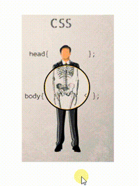

# X-Ray In JavaScript By Amur

# Install

npm i React-XRay

## Documentation

### Default options

    backgroundColor={'transparent'}
    beyond={false}
    diameter={150}
    cursor={true}
    type={'circle'}
    responsive={false}
    resize={[
        {
            screen: 1199,
            diameter: 130
        },
        {
            screen: 991,
            diameter: 100
        },
        {
            screen: 767,
            diameter: 80
        },
        {
            screen: 575,
            diameter: 50
        }
    ]}

### Prototype and values

| Props            | Type             | Value                                                                     |
| ---------------- | ---------------- | ------------------------------------------------------------------------- |
| backgroundColor  | String           | "transparent" or color                                                    |
| type             | String           | "circle"  or "magnifyingGlass"                                            |
| beyond           | Boolean          | true  or false                                                            |
| diameter         | Number           | exp 150 (size circle)                                                     |
| responsive       | Boolean          | true  or false                                                            |
| cursor           | Boolean          | true  or false                                                            |
| resize           | Array => object  | [{ screen: 1199, diameter: 50}, ..., { screen: number, diameter: number}] |

### Example

    import React from 'react';
    import XRay from 'React-XRay';
    import img1 from './img/1.png';
    import img2 from './img/2.png';

    .........
    .........
    .........

    <XRay
        images={
          [img1, img2]
        }
        beyond={false}
        diameter={100}
        cursor={true}
        responsive={true}
        type={'circle'}
        backgroundColor={'#00AAFF'}
        resize={[
            {
                screen: 1199,
                diameter: 100
            },
            {
                screen: 991,
                diameter: 50
            }
        ]}
    />